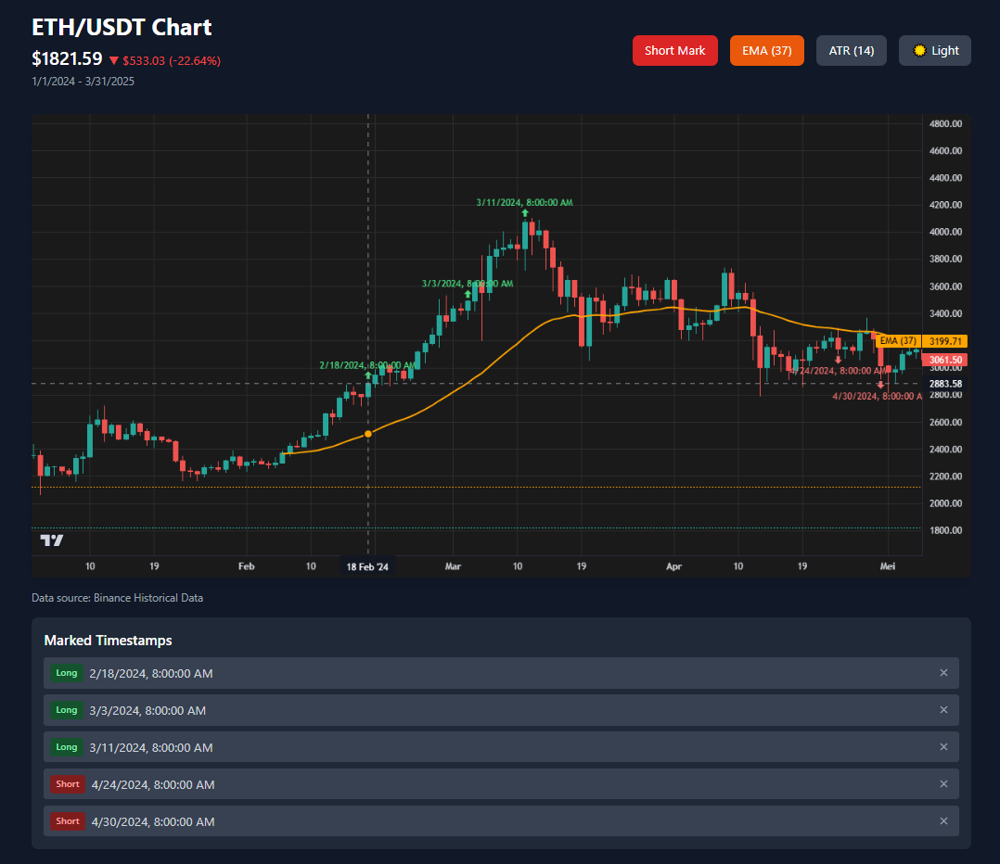

# 📊 Interactive Backtest Engine

An interactive, browser-based backtest engine for manually marked trades. Upload historical OHLCV data, define trade entry points, adjust take-profit/stop-loss settings on the fly, and get instant performance feedback. Built with React, TypeScript, and TradingView's Lightweight Charts.

---

## 🚀 Features

- 📈 Interactive candlestick chart with technical indicators
- ✍️ Manual trade entry marking
- ⚙️ Adjustable take-profit & stop-loss settings
- 📋 Real-time trade list with PnL tracking
- 📊 Performance statistics and analytics
- 🎨 Modern UI with Tailwind CSS

---

## 🛠️ Tech Stack

- **React 18**
- **TypeScript**
- [TradingView Lightweight Charts](https://www.tradingview.com/lightweight-charts/)
- [Technical Indicators](https://www.npmjs.com/package/technicalindicators)
- [Papa Parse](https://www.papaparse.com/) for CSV parsing
- Tailwind CSS for styling

---

## 🚀 Getting Started

1. Clone the repository
2. Install dependencies:
   ```bash
   npm install
   ```
3. Start the development server:
   ```bash
   npm start
   ```

The app will open in your default browser at `http://localhost:3000`

---

## 📁 CSV Format

The uploaded file should be in this format:

```csv
timestamp,open,high,low,close,volume
2024-01-01 09:00:00,100,105,95,102,5000
...
```

---

## 📝 License

MIT License

---

## 🧪 Demo


